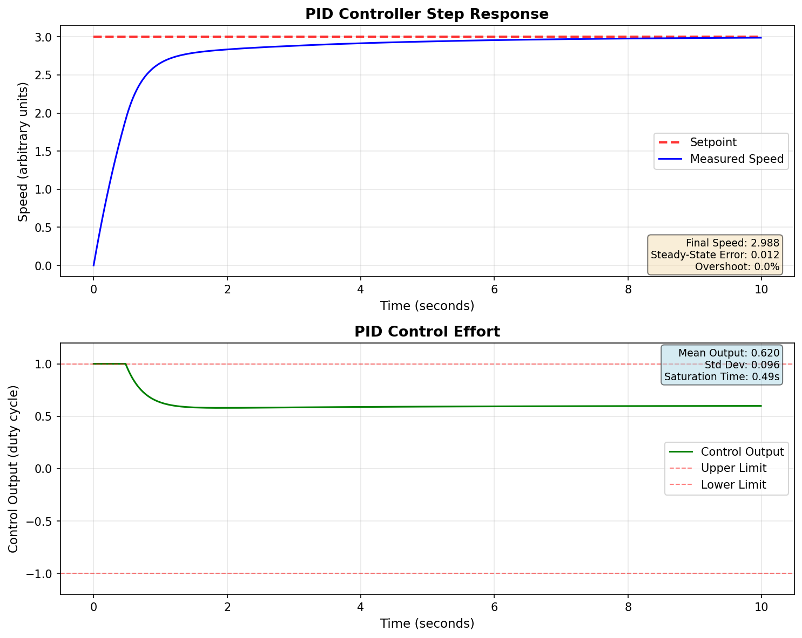

# Embedded Motor PID Controller
[](https://github.com/OnesmoOgore/embedded-motor-pid-controller/actions)
 
  


A modular embedded C and Python project demonstrating a PID speed controller for a DC motor.  
Includes simulation tools, data logging, automated plotting, and a full multi-platform CI pipeline.

---

## 🔍 Overview

This project showcases:

- Clean embedded C architecture (hardware abstraction layer + PID control logic)
- A reusable PID module suitable for MCU or desktop builds
- A Python simulation tool for offline tuning and step-response analysis
- Automated CI on multiple platforms (via GitHub Actions)
- Strict compilation rules (`-Wall -Wextra -Werror`) to enforce code quality
- Downloadable CI artifacts (`log.csv`, `step_response.png`) for every build

Designed for embedded, robotics, and controls-focused engineers who value structure, repeatability, and portability.

---

## ✨ Features

### PID Controller
- **Production-ready PID implementation** with industry best practices
- **Proper anti-windup** via integrator clamping
- **Derivative-on-measurement** (eliminates derivative kick)
- **Optional derivative filtering** to reduce noise sensitivity
- **Configurable output and integrator limits**
- Fixed-point friendly design

### Testing & Build System
- **Comprehensive unit tests** using Unity framework (12 test cases)
- **Professional CMake build system** with cross-platform support
- **Modular libraries** for easy integration
- **Automated testing** via GitHub Actions CI/CD

### Simulation & Visualization
- Simple motor plant model for desktop testing
- Tunable PID gains
- CSV data logging and visualization
- Step response plotting

### Code Quality
- Strict compilation rules (`-Wall -Wextra -Werror`)
- Cross-platform builds (Linux, macOS, Windows)
- Portable, MCU-agnostic structure
- Doxygen documentation support

---

## 📂 Folder Structure

```
embedded-motor-pid-controller/
├── firmware/
│   ├── src/          # PID controller, motor model, main loop
│   └── include/      # Public API headers
├── tests/
│   └── test_pid.c    # Unit tests (Unity framework)
├── sim/              # Python simulation & plotting
│   └── pid_simulation.py
├── docs/             # Documentation
│   ├── images/       # Documentation images
│   ├── BUILD.md      # Build instructions
│   ├── architecture.md  # System architecture
│   ├── ci.md         # CI/CD documentation
│   ├── index.md      # GitHub Pages landing page
│   └── _config.yml   # Jekyll configuration
├── .github/
│   └── workflows/
│       └── ci.yml    # CI/CD configuration
├── CHANGELOG.md      # Version history
├── CMakeLists.txt    # Build system configuration
├── Doxyfile          # API documentation configuration
├── requirements.txt  # Python dependencies
└── LICENSE           # MIT License
```

---

## 🔨 Building

### Quick Start

```bash
# Clone Unity test framework
git clone https://github.com/ThrowTheSwitch/Unity.git tests/Unity

# Configure and build
mkdir build && cd build
cmake ..
make

# Run tests
./test_pid
# Or use CTest
ctest --output-on-failure
```

### Build Options

```bash
# Release build (optimized)
cmake -DCMAKE_BUILD_TYPE=Release ..

# Build without tests
cmake -DBUILD_TESTS=OFF ..

# Build only library
cmake -DBUILD_TESTS=OFF -DBUILD_DEMO=OFF ..
```

For detailed build instructions, see [docs/BUILD.md](docs/BUILD.md).

### MCU Integration

This repo is MCU-agnostic. To port to a specific microcontroller:
1. Add your HAL/BSP in `firmware/src/`
2. Configure CMake with your toolchain file
3. Link the `pid_controller` library

Example integration:
```c
#include "pid.h"

pid_t motor_pid;
pid_init(&motor_pid, 1.0f, 0.5f, 0.1f, 0.01f, -100.0f, 100.0f);

// In control loop
float output = pid_compute(&motor_pid, setpoint, measurement);
```

---

## 🧠 Running the Simulation (Desktop)

### Prerequisites
```bash
# Install Python dependencies
pip install -r requirements.txt
```

### Run Simulation
```bash
cd sim
python pid_simulation.py
```

This will:
1. Compile the firmware using gcc
2. Run the closed-loop simulation
3. Generate `log.csv` with time-series data
4. Produce `step_response.png` plot
5. Display the plot (GUI) or save only (CI mode)

---

## 📊 Example Step Response

Here is an example step response produced by `sim/pid_simulation.py`:



---

## 📈 Continuous Integration

GitHub Actions automatically tests every commit on Ubuntu and Windows:
- Builds with strict warnings (`-Wall -Wextra -Werror`)
- Runs all 12 unit tests
- Executes Python simulation and generates plots
- Uploads artifacts (CSV logs, response plots)

[View CI runs and artifacts](../../actions)

---

## 📄 License

This project is licensed under the MIT License.
See [`LICENSE`](LICENSE) for details.

---

## 📚 Documentation

- **[Build Instructions](docs/BUILD.md)** - Comprehensive build guide
- **[Changelog](CHANGELOG.md)** - Version history and detailed release notes
- **[Architecture Overview](docs/architecture.md)** - System design and CI/CD pipeline

### API Documentation
Generate with Doxygen:
```bash
doxygen Doxyfile
# Output: docs/api/html/index.html
```

## 🚀 Quick Example

```c
#include "pid.h"
#include <stdio.h>

int main(void) {
    pid_t motor_pid;

    // Initialize with Kp=1.0, Ki=0.5, Kd=0.1, dt=10ms
    pid_init(&motor_pid, 1.0f, 0.5f, 0.1f, 0.01f, -100.0f, 100.0f);

    float setpoint = 100.0f;  // Target speed
    float measurement = 0.0f; // Current speed

    for (int i = 0; i < 100; i++) {
        float output = pid_compute(&motor_pid, setpoint, measurement);
        printf("Output: %.2f\n", output);

        // Simulate motor response (placeholder)
        measurement += output * 0.01f;
    }

    return 0;
}
```

## 🤝 Contributing

Contributions are welcome! This project follows best practices for embedded C development:
- Use strict compiler warnings (`-Wall -Wextra -Werror`)
- Write unit tests for new features
- Follow existing code style
- Update documentation

## 🙏 Acknowledgments

- **Unity Testing Framework** by ThrowTheSwitch
- PID control theory and best practices from the embedded controls community
