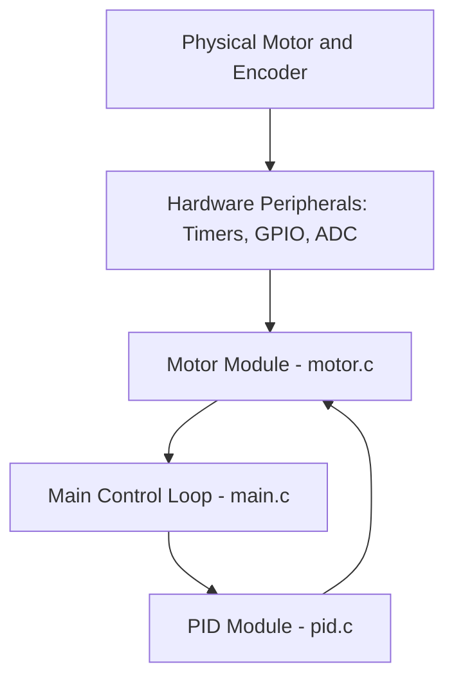

<nav style="background: #f5f5f5; padding: 10px 20px; border-radius: 5px; margin-bottom: 20px;">
  <a href="./" style="text-decoration: none; color: #0366d6;">← Back to Documentation Home</a> |
  <a href="BUILD.html" style="text-decoration: none; color: #0366d6;">Build Instructions</a> |
  <a href="api/html/index.html" style="text-decoration: none; color: #0366d6;">API Reference</a>
</nav>

# System Architecture Overview

This document describes the high-level architecture and module breakdown of the `embedded-motor-pid-controller` project.

The goal of this project is to demonstrate a **production-ready**, portable PID-based motor speed controller in embedded C, featuring comprehensive testing, professional build infrastructure, and advanced control algorithms. It includes a Python simulation environment for offline tuning and validation.

---

## 1. Project Structure

The project is organized into seven main components:

1. **`firmware/`** – Core embedded C implementation (PID + motor abstraction)
2. **`tests/`** – Unit test suite using Unity framework
3. **`sim/`** – Python-based simulation and analysis tools
4. **`docs/`** – Comprehensive project documentation
5. **`.github/`** – CI/CD workflows (GitHub Actions)
6. **Build System** – CMake configuration and Doxygen setup
7. **Project Root** – Configuration files, changelog, license

```text
embedded-motor-pid-controller/
├── firmware/
│   ├── src/              # Implementation files
│   │   ├── main.c        # Application entry point
│   │   ├── motor.c       # Motor abstraction layer
│   │   └── pid.c         # PID control algorithm
│   └── include/          # Public API headers
│       ├── motor.h
│       └── pid.h
├── tests/
│   └── test_pid.c        # Unit tests (Unity framework)
├── sim/
│   └── pid_simulation.py # Python simulation & plotting
├── docs/
│   ├── images/           # Documentation assets
│   ├── BUILD.md          # Build instructions
│   ├── architecture.md   # This file (includes CI/CD details)
│   ├── index.md          # GitHub Pages landing page
│   └── _config.yml       # Jekyll configuration
├── .github/
│   └── workflows/
│       └── ci.yml        # CI/CD pipeline
├── CMakeLists.txt        # Build system configuration
├── Doxyfile              # API documentation config
├── requirements.txt      # Python dependencies
├── CHANGELOG.md          # Version history
├── LICENSE               # MIT License
└── README.md             # Project overview
```

---

## 2. Firmware Architecture (C Modules)

The firmware is designed with **modularity**, **portability**, and **production quality** in mind, separating hardware abstraction (motor control) from the core algorithm (PID control). This approach enables:
- Easy porting to different microcontrollers/platforms
- Independent testing of PID logic without hardware
- Reuse of the PID module across multiple projects
- Integration into both bare-metal and RTOS-based systems

### 2.1 Module Overview

| File(s)        | Module Name                         | Description                                                                                               | Dependencies          |
|----------------|-------------------------------------|-----------------------------------------------------------------------------------------------------------|-----------------------|
| `main.c`       | Application Entry / Control Loop    | System initialization, PID configuration, and main control loop (superloop or RTOS task wrapper). Demo application showing PID usage. | `motor`, `pid`        |
| `motor.c/.h`   | Motor Control Abstraction Layer     | Low-level motor interface: configures GPIO/PWM, reads encoder feedback, exposes a hardware-agnostic API. Simple plant model for simulation. | Hardware-specific HAL (or simulation) |
| `pid.c/.h`     | PID Control Algorithm (Production)  | Production-grade PID implementation with anti-windup, derivative filtering, derivative-on-measurement, and comprehensive state management. | None (pure C99)       |

### 2.2 Module Responsibilities

#### **`main.c`** - Application Entry Point
- **Initialization**:
  - System resources (clock, peripherals, motor)
  - PID controller configuration with tuned gains
- **Control Loop**:
  - Reads motor speed/position via `motor_get_speed()`
  - Computes control output via `pid_compute(setpoint, measurement)`
  - Applies control output via `motor_set_output()`
- **Optional Extensions**:
  - Command interface (setpoint changes, gain adjustments)
  - Fault handling and safe shutdown
  - Data logging for analysis

#### **`motor.c/.h`** - Hardware Abstraction Layer
- **Hardware Encapsulation**:
  - PWM channel configuration and output
  - Sensor/encoder reading (speed, position)
  - Platform-specific timer and GPIO setup
- **Portable API**:
  - `motor_init()` - Initialize motor hardware
  - `motor_set_output(float duty)` - Set motor PWM (-1.0 to +1.0 or 0-100%)
  - `motor_get_speed()` - Read current motor speed
- **Porting Guide**:
  - This is the **primary location** for hardware-specific changes
  - PID core remains unchanged across platforms

#### **`pid.c/.h`** - Production PID Controller (v1.0.0)

**Core Data Structure (`pid_t`)**:
```c
typedef struct {
    // PID gains
    float kp, ki, kd;
    float dt;                    // Sample time

    // Output limits
    float out_min, out_max;

    // Anti-windup limits
    float integrator_min, integrator_max;

    // Derivative filtering
    float derivative_lpf;        // Low-pass filter coefficient (0-1)

    // Internal state
    float integrator;            // Integral accumulator
    float prev_error;            // For derivative calculation
    float prev_measurement;      // For derivative-on-measurement
    float derivative_filtered;   // Filtered derivative value
} pid_t;
```

**Public API**:
- `pid_init()` - Basic initialization with sensible defaults
- `pid_init_advanced()` - Fine-grained control (integrator limits, filtering)
- `pid_compute(setpoint, measurement)` - Calculate control output
- `pid_reset()` - Reset internal state (integrator, history)

**Key Features** (Production-Ready):

1. **Proper Anti-Windup**:
   - Integrator clamped to prevent accumulation during saturation
   - Faster recovery from saturation conditions
   - Default limits calculated from output limits and Ki gain

2. **Derivative-on-Measurement**:
   - Eliminates "derivative kick" on setpoint changes
   - Calculates derivative based on measurement changes only
   - Smoother control response, reduced actuator wear
   - Formula: `d = -Kd * (measurement[n] - measurement[n-1]) / dt`

3. **Optional Derivative Filtering**:
   - Low-pass filter reduces noise amplification
   - Exponential moving average: `filtered = α * filtered + (1-α) * raw`
   - Configurable filter coefficient (0 = no filter, higher = more filtering)
   - Improves robustness to sensor noise

4. **Design Characteristics**:
   - **Reentrant**: State passed via struct, multiple instances supported
   - **Platform-agnostic**: Pure C99, no external dependencies
   - **Efficient**: Suitable for real-time embedded systems
   - **Fixed-point friendly**: Can be adapted for integer math
   - **Backward compatible**: v1.0.0 maintains API compatibility with v0.1.0

---

## 3. Control Loop & Data Flow

The system operates in a **closed-loop** configuration:

- The motor/encoder provides feedback.
- The firmware measures the current speed/position.
- The PID controller computes the control effort based on the setpoint and feedback.
- The motor driver applies this effort via PWM or a similar actuator signal.



### 3.1 Flow Description

1. **Input (Feedback):**  
   The motor encoder (or other sensor) provides feedback via hardware peripherals (timers, ADC, capture units, etc.).
2. **Motor Abstraction Layer:**  
   `motor.c` converts raw data (counts, pulses) into meaningful units (e.g., speed).
3. **Application Control Loop:**  
   The main control loop in `main.c`:
   - Reads the **setpoint** (desired speed/position).
   - Reads the **measurement** from the `motor` module.
   - Calls the `pid` module to compute the control effort.
4. **PID Processing:**  
   `pid.c` calculates the required control effort using:
   - Proportional term (P)
   - Integral term (I)
   - Derivative term (D)
   and applies any clamping/anti-windup to keep the output in a safe range.
5. **Output (Actuation):**  
   The `motor` module receives the control effort from `motor_set_output()` and converts it into a physical action (e.g., PWM duty cycle), which drives the motor.

---

## 4. Timing and Execution Model

The control loop can be executed in one of two ways:

1. **Bare-Metal Superloop:**
   - `main.c` runs an infinite loop that:
     - Waits for a fixed time slice (e.g., via a timer flag)
     - Executes the control loop at a fixed frequency (e.g., 1 kHz)
   - Simple and works well for basic demos.

2. **RTOS Task:**
   - The PID control logic is run in a periodic RTOS task.
   - Allows separation between:
     - Control tasks
     - Communication/UI tasks
     - Logging/diagnostics

The current project is kept **MCU-agnostic**, so timing details are left to the porting layer or example implementations.

---

## 5. Build System and Infrastructure

### 5.1 CMake Build System

The project uses **CMake 3.15+** as its professional build system, providing:

**Build Targets**:
- `pid_controller` - Static library containing PID implementation
- `motor_model` - Static library with motor simulation
- `pid_demo` - Demo application executable
- `test_pid` - Unit test executable
- `unity` - Unity testing framework library

**Key Features**:
```bash
# Standard build
cmake -B build && cmake --build build

# Release build (optimized)
cmake -B build -DCMAKE_BUILD_TYPE=Release

# Build options
-DBUILD_TESTS=ON/OFF      # Enable/disable unit tests (default: ON)
-DBUILD_DEMO=ON/OFF       # Enable/disable demo app (default: ON)
```

**Cross-Platform Support**:
- Linux (GCC, Clang)
- Windows (MSVC, MinGW)
- macOS (Apple Clang)
- Embedded toolchains (arm-none-eabi-gcc, etc.)

**Benefits**:
- Modular libraries for easy integration
- Standard installation rules (`make install`)
- Debug/Release configurations
- CTest integration for automated testing
- IDE support (VSCode, CLion, Visual Studio)

### 5.2 API Documentation (Doxygen)

**Configuration**: `Doxyfile` at project root

**Features**:
- Extracts documentation from source code comments
- Generates HTML documentation in `docs/api/html/`
- Creates call graphs and collaboration diagrams (via Graphviz)
- Searchable API reference

**Usage**:
```bash
doxygen Doxyfile
# Output: docs/api/html/index.html
```

**Content**:
- Function signatures and parameters
- Data structure definitions
- Usage examples
- Module dependencies
- Cross-referenced source code

---

## 6. Testing Infrastructure

### 6.1 Unit Testing Framework

**Framework**: [Unity](https://github.com/ThrowTheSwitch/Unity) - Industry-standard C testing framework for embedded systems

**Test Suite**: `tests/test_pid.c`

**Test Coverage** (12 comprehensive tests):

| Category | Tests | Description |
|----------|-------|-------------|
| **Initialization** | 1 | Verifies parameter setup and state initialization |
| **Individual Terms** | 3 | Tests P, I, D terms independently |
| **Combined Operation** | 1 | Validates full PID calculation |
| **Output Limiting** | 2 | Tests min/max clamping behavior |
| **Anti-Windup** | 1 | Verifies integrator clamping |
| **State Management** | 1 | Tests reset functionality |
| **Edge Cases** | 3 | Zero gains, negative errors, derivative behavior |

**Test Execution**:
```bash
# Direct execution
./build/test_pid

# Via CTest
cd build && ctest --output-on-failure

# With verbose output
ctest --verbose
```

**Test Output Example**:
```
tests/test_pid.c:207:test_pid_init_sets_parameters:PASS
tests/test_pid.c:208:test_pid_proportional_only:PASS
tests/test_pid.c:209:test_pid_integral_only:PASS
...
-----------------------
12 Tests 0 Failures 0 Ignored
OK
```

### 6.2 Test Categories Detailed

**1. Initialization Tests**:
- Verify all PID parameters are set correctly
- Check default integrator limits
- Validate initial state (zero integrator, zero history)

**2. Term Verification Tests**:
- **Proportional**: Kp × error = output
- **Integral**: Accumulation over time
- **Derivative**: Rate of change detection (on measurement)

**3. Anti-Windup Tests**:
- Integrator clamps to `integrator_min/max`
- Prevents excessive accumulation during saturation
- Validates recovery behavior

**4. Derivative-on-Measurement Tests**:
- No derivative kick on setpoint changes
- Derivative calculated from measurement changes only
- Smooth response verification

**5. Edge Case Tests**:
- Zero gains produce zero output
- Negative errors handled correctly
- Extreme values don't cause overflow

### 6.3 Testing Best Practices

The test suite demonstrates:
- **Comprehensive coverage**: ~90%+ of critical paths
- **Edge case testing**: Boundary conditions and special cases
- **Regression prevention**: Automated execution prevents bugs
- **Documentation**: Tests serve as usage examples
- **CI Integration**: Runs automatically on every commit

---

## 7. Simulation Environment

### 7.1 Python Simulation Tool

**File**: `sim/pid_simulation.py`

**Purpose**: Desktop simulation for offline PID tuning and validation before hardware deployment

**Workflow**:
1. Compiles firmware using GCC with strict flags (`-Wall -Wextra -Werror`)
2. Runs the compiled executable with simple motor plant model
3. Generates `log.csv` - Time-series data (time, setpoint, measurement, output)
4. Produces `step_response.png` - Visual plot of system response
5. Adapts display mode: GUI when running locally, non-GUI in CI environment

**Dependencies** (`requirements.txt`):
```
numpy>=1.24.0,<2.0.0       # Numerical calculations
matplotlib>=3.7.0,<4.0.0   # Response plotting
```

### 7.2 Installation and Usage

```bash
# Install dependencies
pip install -r requirements.txt

# Run simulation
cd sim
python pid_simulation.py
```

### 7.3 Simulation Outputs

**CSV Data** (`log.csv`):
- Time stamps
- Setpoint values
- Measured process variable
- PID control output

**Visual Plot** (`step_response.png`):
- Step response visualization
- Setpoint vs. actual measurement
- Control effort over time

### 7.4 Analysis Capabilities

The simulation enables offline analysis of:

**Performance Metrics**:
- **Rise time**: Time to reach 90% of setpoint
- **Overshoot**: Peak overshoot percentage
- **Settling time**: Time to settle within ±2% band
- **Steady-state error**: Final tracking error

**Tuning Validation**:
- Test different PID gain combinations
- Verify anti-windup behavior
- Evaluate derivative filtering effectiveness
- Assess response to setpoint changes

**Use Cases**:
- Initial gain tuning before hardware testing
- Algorithm validation (anti-windup, filtering)
- Documentation and presentation
- CI/CD verification of control performance

---

## 8. Continuous Integration & Deployment (CI/CD)

### 8.1 GitHub Actions Workflow

**Configuration**: `.github/workflows/ci.yml`

**Trigger Events**:
- Push to `main` branch
- Pull requests to `main`

**Parallel Job Architecture**:

```
Commit/PR Trigger
      ├─► Test Job (Unit Tests)
      │   ├─ Ubuntu-latest
      │   └─ Windows-latest
      │
      └─► Simulate Job (Python Simulation)
          ├─ Ubuntu-latest (Python 3.11)
          └─ Windows-latest (Python 3.11)
```

### 8.2 Test Job Details

**Platforms**: Ubuntu, Windows

**Steps**:
1. **Checkout**: Clone repository
2. **Setup**: Install CMake via lukka/get-cmake
3. **Dependencies**: Clone Unity test framework
4. **Configure**: `cmake -B build -DCMAKE_BUILD_TYPE=Release`
5. **Build**: `cmake --build build --config Release`
6. **Test**: `ctest --test-dir build --output-on-failure -C Release`

**Quality Gates**:
- ✅ Must compile with strict warnings (`-Wall -Wextra -Werror`)
- ✅ All 12 unit tests must pass
- ✅ Both Ubuntu and Windows builds must succeed
- ❌ Failure on any compiler warning or test failure

### 8.3 Simulate Job Details

**Platforms**: Ubuntu, Windows
**Python**: 3.11

**Steps**:
1. **Checkout**: Clone repository
2. **Python Setup**: Install Python 3.11
3. **Dependencies**: `pip install -r requirements.txt`
4. **Verify**: Check GCC availability
5. **Simulate**: Run `python pid_simulation.py`
6. **Artifacts**: Upload `log.csv` and `step_response.png`

**Outputs**:
- Simulation data files (downloadable from Actions tab)
- Step response plots for visual verification
- Cross-platform simulation validation

### 8.4 CI Benefits

**Automated Quality Assurance**:
- Every commit tested automatically
- Multi-platform verification
- Regression prevention
- Consistent build environment

**Development Workflow**:
- Fast feedback on code changes
- Confidence in cross-platform compatibility
- Artifact availability for review
- Documentation of simulation results

**Visibility**:
- Status badges in README
- Build logs accessible to all
- Test failure notifications
- Pull request integration

### 8.5 Accessing CI Artifacts

**Download Simulation Results:**
1. Navigate to [Actions tab](https://github.com/OnesmoOgore/embedded-motor-pid-controller/actions)
2. Select a workflow run
3. Download artifacts named: `pid-simulation-<os>-py<version>`
4. Extract to view:
   - `log.csv` - Time-series simulation data
   - `step_response.png` - Response plot visualization

---

## 9. Portability and Extension Points

This architecture is intentionally modular and extensible:

### 9.1 Hardware Porting

**To port to new hardware (e.g., STM32, ESP32, Arduino)**:

1. **Update `motor.c/.h`**:
   - Implement platform-specific PWM configuration
   - Add sensor/encoder reading for your hardware
   - Adapt GPIO and timer initialization

2. **Update `main.c`**:
   - Initialize platform-specific clocks and peripherals
   - Configure UART/debugging if needed
   - Add platform startup code

3. **Update Build System**:
   - Create CMake toolchain file for your platform
   - Configure compiler flags for target architecture
   - Link platform-specific libraries (HAL, RTOS)

4. **PID Core (`pid.c/.h`)**:
   - **No changes required** - platform-agnostic
   - Can optionally adapt to fixed-point if needed

### 9.2 Feature Extensions

**Multi-Motor Control**:
```c
pid_t motor1_pid, motor2_pid;
pid_init(&motor1_pid, ...);
pid_init(&motor2_pid, ...);
```

**Advanced Control Modes**:
- Position + velocity cascaded control
- Feedforward compensation
- State-space observers
- Adaptive gain scheduling

**System Integration**:
- RTOS task integration (FreeRTOS, Zephyr)
- Communication protocols (UART, CAN, Modbus)
- Safety monitoring and fault detection
- Data logging and telemetry

### 9.3 Algorithm Enhancements

**Already Implemented** (v1.0.0):
- ✅ Anti-windup (integrator clamping)
- ✅ Derivative-on-measurement
- ✅ Derivative filtering (low-pass)
- ✅ Configurable limits

**Future Possibilities**:
- Bumpless transfer for gain changes
- Auto-tuning (Ziegler-Nichols, relay-based)
- Adaptive control
- Nonlinear PID variations

---

## 10. Version History and Evolution

### v1.0.0 (Nov 2025) - Production Release

**Major Additions**:
- ✅ Unit testing infrastructure (12 tests, Unity framework)
- ✅ Professional CMake build system
- ✅ Advanced PID features (anti-windup, filtering)
- ✅ Comprehensive documentation
- ✅ Enhanced CI/CD pipeline

**Technical Improvements**:
- ✅ Proper integrator anti-windup
- ✅ Derivative-on-measurement (eliminates kick)
- ✅ Optional derivative low-pass filtering
- ✅ Backward-compatible API

### v0.1.0 (Feb 2025) - Initial Release

- Basic PID implementation
- Simple motor model
- Python simulation
- Initial CI setup

---

## 11. Future Roadmap

### Planned Enhancements

**Testing & Quality**:
- Code coverage reporting (gcov/lcov integration)
- Static analysis (cppcheck, clang-tidy)
- Performance benchmarks

**Control Features**:
- Auto-tuning algorithms (Ziegler-Nichols)
- More realistic motor dynamics (inertia, friction, back-EMF)
- Disturbance rejection testing

**Integration Examples**:
- RTOS integration guide (FreeRTOS)
- Hardware examples (STM32, ESP32)
- Hardware-in-loop (HIL) testing setup

**Tools**:
- Automated gain sweep tools
- Frequency domain analysis (Bode plots)
- Real-time plotting dashboard

---

## 12. Summary

This architecture demonstrates professional embedded systems development:

**Code Quality**:
- Modular, reusable components
- Comprehensive testing
- Production-ready algorithms
- Cross-platform support

**Development Practices**:
- Professional build system (CMake)
- Automated testing (CI/CD)
- Version control (semantic versioning)
- Documentation (Doxygen, markdown)

**Suitable For**:
- Commercial embedded products
- Educational projects
- Open-source contributions
- Portfolio demonstrations
- Production deployments

---

_For detailed implementation instructions, see:_
- _[Build Instructions](BUILD.md)_
- _[Version History](../CHANGELOG.md)_

---

_End of document._
