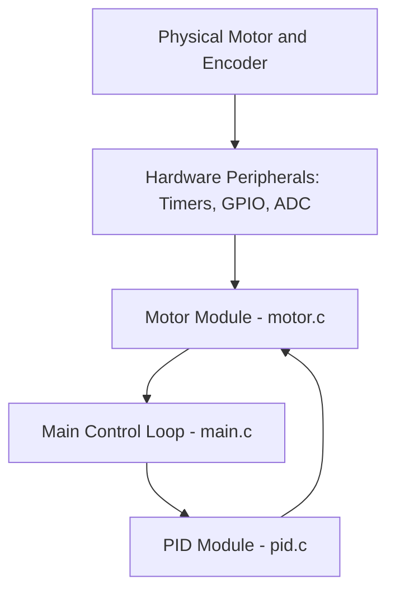

# System Architecture Overview

This document describes the high-level architecture and module breakdown of the `embedded-motor-pid-controller` project.

The goal of this project is to demonstrate a clean, portable PID-based motor speed controller in embedded C, with a matching Python simulation environment for tuning and validation.

---

## 1. Project Structure

The project is divided into five main components:

1. **`firmware/`** – the main embedded C application
2. **`sim/`** – Python-based simulation and analysis tools
3. **`docs/`** – project documentation
4. **`.github/`** – GitHub Actions CI workflow
5. **`README.md`** – project overview, build instructions, and status

```text
embedded-motor-pid-controller/
├─ firmware/
│  ├─ src/
│  │  ├─ main.c
│  │  ├─ motor.c
│  │  ├─ pid.c
│  ├─ include/
│  │  ├─ motor.h
│  │  ├─ pid.h
├─ sim/
│  ├─ pid_simulation.py
├─ docs/
│  ├─ architecture.md
│  ├─ ci.md
├─ .github/
│  ├─ workflows/
│  │  ├─ ci.yml
├─ README.md
```

---

## 2. Firmware Architecture (C Modules)

The firmware is designed with **modularity** and **portability** in mind,
separating hardware abstraction (motor control) from the core algorithm
(PID control). This approach makes it easy to:
- Port the code to different microcontrollers/platforms
- Test the PID logic independently of hardware
- Reuse the PID module in other projects

### 2.1 Module Overview

| File(s)        | Module Name                         | Description                                                                                               | Dependencies          |
|----------------|-------------------------------------|-----------------------------------------------------------------------------------------------------------|-----------------------|
| `main.c`       | Application Entry / Control Loop    | System initialization, configuration loading, and main control loop (superloop or RTOS task wrapper).                      | `motor`, `pid`        |
| `motor.c/.h`   | Motor Control Abstraction Layer     | Low-level motor interface: configures GPIO/PWM, reads encoder feedback, exposes a hardware-agnostic API.             | Hardware-specific HAL |
| `pid.c/.h`     | PID Control Algorithm               | Core PID math: error calculation, proportional/integral/derivative terms, output limiting/clamping, and state management. | None (pure C)              |

### 2.2 Responsibilities

- **`main.c`**
  - Initializes the system resources (clock, peripherals, motor, PID configuration).
  - Runs the periodic control loop:
    - Reads motor speed/position via `motor_get_speed()`.
    - Calls `pid_compute()` with setpoint and measurement.
    - Sends control output to motor via `motor_set_output()`. module.
  - May optionally handle:
    - Simple command interface (e.g., changing setpoint)
    - Fault handling / safe shutdown

- **`motor.c/.h`**
  - Encapsulates all hardware-specific details:
    - PWM channel configuration
    - Reading sensor/encoder counts
  - Exposes a portable API:
    - `motor_init(...)`
    - `motor_set_output(float duty)` (typically -1.0 to +1.0)
    - `motor_get_speed(void)`
  - Primary location for porting when targeting new hardware.

- **`pid.c/.h`**
  - Contains a PID state struct (error terms, integrator, derivative history).
  - Implements:
    - `pid_init(...)`
    - `pid_compute(setpoint, measurement)`
    - Optional helpers (reset, update gains, anti-windup).
  - Designed to be:
    - Reentrant (state passed in via struct)
    - Usable on bare-metal or RTOS-based systems
    - Friendly to fixed-point implementations if needed

---

## 3. Control Loop & Data Flow

The system operates in a **closed-loop** configuration:

- The motor/encoder provides feedback.
- The firmware measures the current speed/position.
- The PID controller computes the control effort based on the setpoint and feedback.
- The motor driver applies this effort via PWM or a similar actuator signal.



### 3.1 Flow Description

1. **Input (Feedback):**  
   The motor encoder (or other sensor) provides feedback via hardware peripherals (timers, ADC, capture units, etc.).
2. **Motor Abstraction Layer:**  
   `motor.c` converts raw data (counts, pulses) into meaningful units (e.g., speed).
3. **Application Control Loop:**  
   The main control loop in `main.c`:
   - Reads the **setpoint** (desired speed/position).
   - Reads the **measurement** from the `motor` module.
   - Calls the `pid` module to compute the control effort.
4. **PID Processing:**  
   `pid.c` calculates the required control effort using:
   - Proportional term (P)
   - Integral term (I)
   - Derivative term (D)
   and applies any clamping/anti-windup to keep the output in a safe range.
5. **Output (Actuation):**  
   The `motor` module receives the control effort from `motor_set_output()` and converts it into a physical action (e.g., PWM duty cycle), which drives the motor.

---

## 4. Timing and Execution Model

The control loop can be executed in one of two ways:

1. **Bare-Metal Superloop:**
   - `main.c` runs an infinite loop that:
     - Waits for a fixed time slice (e.g., via a timer flag)
     - Executes the control loop at a fixed frequency (e.g., 1 kHz)
   - Simple and works well for basic demos.

2. **RTOS Task:**
   - The PID control logic is run in a periodic RTOS task.
   - Allows separation between:
     - Control tasks
     - Communication/UI tasks
     - Logging/diagnostics

The current project is kept **MCU-agnostic**, so timing details are left to the porting layer or example implementations.

---

## 5. Simulation Environment

The `sim/pid_simulation.py` file implements a **Python-based simulation** of the motor + PID loop.
- Compiles firmware using gcc with strict flags  
- Runs the resulting executable
- Generates log.csv (step, setpoint, speed, control output)  
- Produces step_response.png  
- Uses a non-GUI backend in CI and GUI when running locally

### 5.1 Purpose

- Validate the behavior of the C PID implementation
- Visualize:
 - Step response
 - Overshoot
 - Settling time
 - Steady-state error
- Allow **offline PID tuning** before deploying to real hardware

### 5.2 Tools and Libraries

Typical dependencies (to be listed in the README or requirements file):
- `numpy` – numerical calculations and discrete-time simulation
- `matplotlib` – plotting responses (e.g., setpoint vs. output, error over time)

### 5.3 Workflow

1. Build the firmware binary using gcc.
2. Run the binary to generate `log.csv` (step, setpoint, speed, control output).
3. Load `log.csv` in Python and plot the result.
4. Adjust PID gains and repeat.

> Future extension: implement faster gain sweeps and analytical experiments.

---

## 6. Portability and Extension Points

This architecture is intentionally simple and extendable:

- **Porting to new hardware:**
  - Only `motor.c/.h` and platform-specific startup code need changes.
  - PID core remains the same.

- **Extending the controller:**
  - Support for multiple motors/axes
  - Additional control modes (e.g., position + velocity)
  - Feedforward terms or advanced filters

- **Integrating with larger systems:**
  - Expose a simple API or protocol for higher-level control (e.g., via UART/CAN).
  - Wrap the firmware in an RTOS-based application with communication tasks.

---

## 7. Continuous Integration Summary

- Runs on Ubuntu, Windows  
- Python 3.11  
- Artifacts uploaded per job (log.csv and step_response.png)  
- Ensures:
  - Clean firmware builds (-Wall -Wextra -Werror)
  - Successful simulation execution
  - Cross-platform reproducibility

---

## 8. Future Enhancements

- More realistic motor model  
- CLI-based gain sweeping  
- Unit tests for PID
- GitHub Pages dashboard for simulation results
- GitHub Pages results dashboard

---

_End of file._
